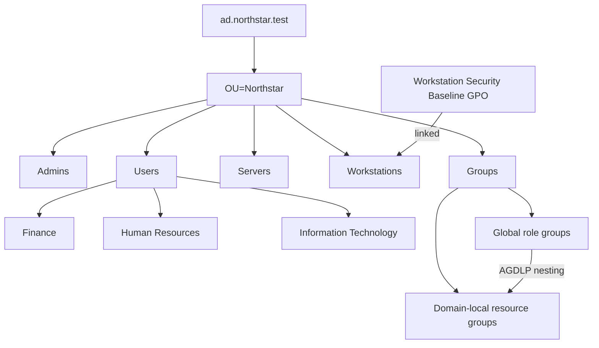

# Architecture and design decisions

## Logical design

## Why this structure

- A single top-level OU keeps the lab isolated and gives cleanup a precise boundary.
- Users are organized by department, while groups are centralized by function. Access is assigned to groups rather than directly to user accounts.
- The group model follows AGDLP: accounts join global role groups, global groups join domain-local resource groups, and permissions would be assigned to those domain-local groups.
- Administrative accounts have a separate OU to support future privileged-access policies. The demo users remain standard accounts.
- The workstation GPO is linked only to the workstation OU, demonstrating scoped policy application and reducing unintended impact.

## Security baseline demonstrated

The sample GPO configures a 15-minute machine inactivity timeout, ensures Microsoft Defender is not disabled through the legacy policy value, and enables PowerShell script-block logging. These settings are educational examples, not a complete production benchmark. A real deployment should map settings to the current Microsoft Security Baseline or CIS Benchmark, test them in rings, and document exceptions.

## Safety boundaries

Every state-changing script verifies that the connected domain DNS name exactly matches `DomainDnsName` in the configuration. Cleanup targets only the configured top-level OU and named GPO, uses `ShouldProcess`, and requires confirmation by default.

